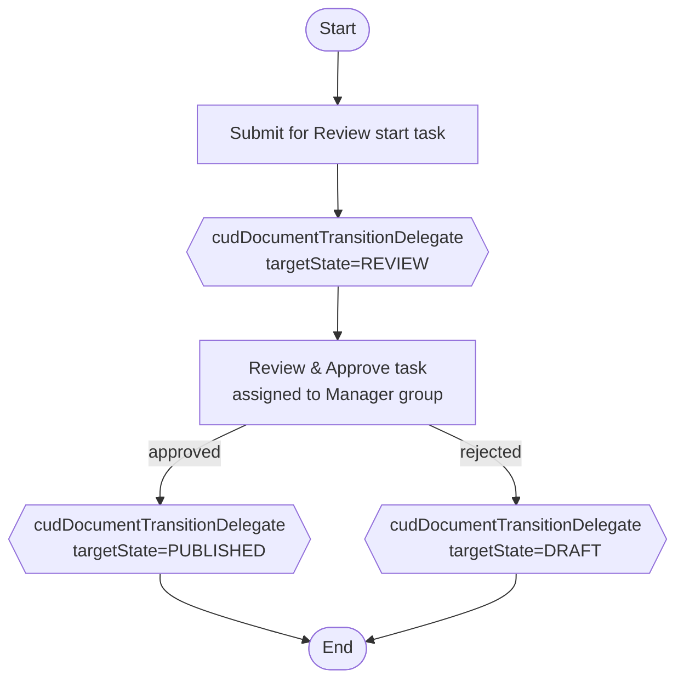
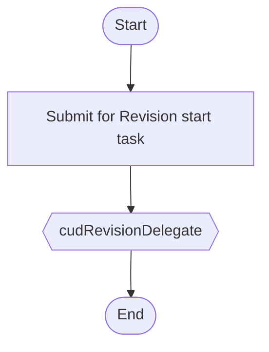

# Custom Module: CUD Document Management v2

Alfresco Content Services custom module that implements a **role-based Document Management System (DMS)** for Canadian University Dubai using the Space Template mechanism, department-level permissions, and lifecycle workflows (Draft → Review → Publish → Archive).

Module: `cud-document-management-v2` (registered in `aio-platform` repository AMP project).

---

## 1. Overview

| Concern | Mechanism |
|---|---|
| Space template | Module bootstrap imports an ACP into `Data Dictionary/Space Templates` |
| Department root marker | Custom aspect `cud:departmentRoot` |
| Folder creation | `OnCreateNode` behaviour creates lifecycle folders under each department |
| Permissions | Permission groups per role, ACLs on each lifecycle folder |
| Document lifecycle | Aspect `cud:documentLifecycle` + Activiti workflows move files between folders |
| Publishing | Publish moves to `_Published` folder and locks the document (read-only) |
| Revision | Published documents can be copied back to Draft via a revision workflow |

### Lifecycle states

| State | Folder suffix | Meaning | Editable by |
|---|---|---|---|
| `DRAFT` | `_Draft` | Working copy | Collaborators + (Co)Managers |
| `REVIEW` | `_Review` | Submitted for approval | Manager can decide |
| `PUBLISHED` | `_Published` | Official version | Managers only (locked) |
| `ARCHIVED` | `_Archive` | Retired, read-only | Managers only |

---

## 2. Module structure

```text
aio-platform/src/main/
├── java/ae/ac/cud/
│   ├── customs/
│   │   └── CudAutoDepartmentBehaviour.java        # OnCreateNode policy
│   └── workflow/lifecycle/
│       ├── CudDocumentTransitionDelegate.java     # moves docs between state folders
│       └── CudRevisionDelegate.java               # copies published docs back to Draft
└── resources/alfresco/module/cud-document-management-v2/
    ├── module-context.xml                          # imports context files below
    ├── context/
    │   ├── bootstrap-context.xml                   # space template import + workflowDeployer
    │   └── service-context.xml                     # dictionary bootstrap + behaviour + delegates
    ├── model/
    │   ├── cud-model.xml                           # departmentRoot + documentLifecycle aspects
    │   └── cud-workflow-model.xml                  # workflow task types (bpm namespace)
    ├── workflow/
    │   ├── cud-document-lifecycle.bpmn20.xml       # submit → review → publish/reject
    │   ├── cud-document-revision.bpmn20.xml        # published → copy into Draft
    │   └── cud-workflow-messages.properties        # UI labels for the two workflows
    └── bootstrap/
        └── cud-space-template.xml                  # ACP: template with cud:departmentRoot aspect
```

---

## 3. Content model (`model/cud-model.xml`)

Namespace: `http://www.cud.ac.ae/model/content/1.0` (prefix `cud`).

### Aspects

| Aspect | Purpose |
|---|---|
| `cud:departmentRoot` | Marker on a department container; triggers folder auto-creation |
| `cud:documentLifecycle` | Stamped on documents by the workflows to track their state |

### Lifecycle properties (on `cud:documentLifecycle`)

| Property | Type | Description |
|---|---|---|
| `cud:lifecycleStatus` | `d:text`, default `DRAFT` | Current state: `DRAFT`, `REVIEW`, `PUBLISHED`, `ARCHIVED` |
| `cud:statusChangedAt` | `d:datetime` | Timestamp of the last transition |
| `cud:statusHistory` | `d:text` (multi-valued) | Audit trail: one entry per transition |

---

## 4. Bootstrap & Spring wiring

### 4.1 Space template ACP

`bootstrap/cud-space-template.xml` contains a `cm:folder` (name `CUD DMS Department Template`, UUID `cud00000-dms0-0000-0000-template0001`) with the `cud:departmentRoot` aspect, imported by `ImporterModuleComponent` into:

```text
/${spaces.company_home.childname}/${spaces.dictionary.childname}/${spaces.templates.childname}
```

i.e. **Company Home / Data Dictionary / Space Templates** — which makes it selectable in the Share “Create rules / New space from template” UI.

### 4.2 Spring context

`module-context.xml` imports:

* `context/bootstrap-context.xml` — the `ImporterModuleComponent` above **plus** `cud.v2.workflowBootstrap` (`parent="workflowDeployer"`) which registers both BPMN definitions and the message bundle.
* `context/service-context.xml` — `cud.v2.dictionaryBootstrap` (loads `cud-model.xml` + `cud-workflow-model.xml`), the behaviour bean `cud.v2.autoDepartmentBehaviour`, and the two workflow delegate beans `cudDocumentTransitionDelegate` / `cudRevisionDelegate`.

> **Important:** bootstrap-context.xml is executed at platform startup. The space template ACP import is idempotent thanks to `uuidBinding=UPDATE_EXISTING`.

---

## 5. Auto folder creation behaviour

Class: `ae.ac.cud.customs.CudAutoDepartmentBehaviour` (implements `OnCreateNodePolicy`).

* Registered on `cm:folder` via `policyComponent.bindClassBehaviour(QName.createQName(NamespaceService.CONTENT_MODEL_1_0_URI, "onCreateNode"), ...)`.
* In `init()` it calls `policyComponent.bindAssociationBehaviour(...)` and injects services.

### Trigger conditions (all must be true)

1. Node type is `cm:folder`.
2. Folder has the `cud:departmentRoot` aspect (either from the template ACP or manually added).
3. Folder name matches the pattern `^[A-Za-z0-9 _-]+$` (no slashes/dots).

### Created structure

For department folder `President`:

```text
President/
├── President_Draft/
├── President_Review/
├── President_Published/
└── President_Archive/
```

### Permission model

Group placeholders are resolved from the folder name (`{DEPT}`):

| ACL | Group | Role |
|---|---|---|
| `_Draft` | `GROUP_{DEPT}_Collaborators` | Consumer (read) — collaborators work here; managers edit |
| `_Draft` | `GROUP_{DEPT}_CoManagers` / `GROUP_{DEPT}_Managers` | Contributor (add/edit) |
| `_Review` | `GROUP_{DEPT}_Managers` | Contributor (decide) |
| `_Published` | `GROUP_{DEPT}_Managers` | Contributor; everyone else read-only via inheritance |
| `_Archive` | `GROUP_{DEPT}_Managers` | Contributor; read-only otherwise |

The behaviour also sets `cm:authorityName` style metadata so that Share can display the department root properly.

---

## 6. Lifecycle workflows (BPMN / Activiti)

Both definitions live in `workflow/` and are deployed by the `workflowDeployer` bean. Labels come from `cud-workflow-messages.properties`.

### 6.1 `cud-document-lifecycle.bpmn20.xml` — Submit for Review



* **Start task** (`cudwf:submitForReviewStart`): user selects document(s), optionally adds a comment; candidate start = anyone with Collaborator access on the Draft folder.
* **Service task 1** moves every document in `bpm_package` from `{Dept}_Draft` to `{Dept}_Review` and sets `cud:lifecycleStatus=REVIEW`.
* **User task** `cudwf:reviewTask` is assigned to `GROUP_{Dept}_Managers` (resolved via `initiator`’s department). The manager toggles `cudwf:approved`.
* **Gateway** routes on `cudwf:approved`:
  * `true` → move to `{Dept}_Published`, status `PUBLISHED`, **document is locked** (`LockType.WRITE_LOCK`) so it is read-only for non-managers.
  * `false` → move back to `{Dept}_Draft`, status `DRAFT`, lock released.

### 6.2 `cud-document-revision.bpmn20.xml` — Submit for Revision



* Available to Managers on a document in `{Dept}_Published`.
* `CudRevisionDelegate` **copies** the published content into `{Dept}_Draft` with name `{base}_rev.{ext}`; the original stays published and locked. The copy gets `cud:lifecycleStatus=DRAFT` and a history entry.

### 6.3 Delegates (Java)

| Bean | Class | Responsibility |
|---|---|---|
| `cudDocumentTransitionDelegate` | `ae.ac.cud.workflow.lifecycle.CudDocumentTransitionDelegate` | Move docs between lifecycle folders, stamp status/history, lock on publish |
| `cudRevisionDelegate` | `ae.ac.cud.workflow.lifecycle.CudRevisionDelegate` | Copy published doc into Draft as a revision seed |

Both resolve folders **relatively**: `currentFolderName.endsWith(suffix)` strips the suffix to obtain the department base name, then looks up the sibling target folder under the department root. No hard-coded paths → works for every department created from the template.

### 6.4 Workflow task model (`model/cud-workflow-model.xml`)

Types (parent chain) used by the forms:

| Type | Parent | Fields shown |
|---|---|---|
| `cudwf:submitForReviewStart` | `bpm:startTask` | `cudwf:submitComment` |
| `cudwf:reviewTask` | `bpm:workflowTask` | `cudwf:approved`, `cudwf:reviewComment` |
| `cudwf:submitForRevisionStart` | `bpm:startTask` | `cudwf:revisionComment` |

Share renders these fields automatically on the default workflow form (no custom form config required).

---

## 7. End-to-end usage

1. **Create a department** — in Share, create a new folder from the *CUD DMS Department Template* space template (or add the `cud:departmentRoot` aspect to an existing folder). The behaviour creates the four lifecycle sub-folders and applies ACLs.
2. **Seed groups** — create `GROUP_{Dept}_Collaborators`, `GROUP_{Dept}_CoManagers`, `GROUP_{Dept}_Managers` and add users.
3. **Draft** — collaborators upload/edit files in `{Dept}_Draft`.
4. **Review** — collaborator starts *CUD Document Lifecycle* on the file → file moves to `{Dept}_Review`, manager gets a task.
5. **Publish / Reject** — manager approves → file moves to `{Dept}_Published` and is locked; rejects → file returns to `{Dept}_Draft`.
6. **Revise** — manager starts *CUD Document Revision* on a published file → a `_rev` copy appears in Draft for re-work.
7. **Archive** — (optional) move retired documents to `{Dept}_Archive` manually or via a future workflow step.

---

## 8. Verification checklist

* `mvn -pl aio-platform compile` → BUILD SUCCESS.
* Restart ACS (Docker compose) → no dictionary bootstrap errors in `alfresco.log`.
* In Share, **Data Dictionary / Space Templates** contains `CUD DMS Department Template`.
* Creating a folder from the template produces `{Dept}_Draft`, `{Dept}_Review`, `{Dept}_Published`, `{Dept}_Archive`.
* Starting *CUD Document Lifecycle* on a draft document moves it between folders and updates `cud:lifecycleStatus`.
* Approving publishes and locks the document; rejecting returns it to Draft.
* Starting *CUD Document Revision* on a published document creates a `_rev` copy in Draft.

---

## 9. Extending the module

* **Archive workflow** — add a third BPMN that uses `cudDocumentTransitionDelegate` with `targetState=ARCHIVED`.
* **Notifications** — add `mail` service tasks or Alfresco policies on state change.
* **Versioning** — enable `cm:versionable` on `cm:content` via aspect/policy to keep versions at each publish.
* **Share UI polish** — add custom form configs in `aio-share` if you want arranged fields; the defaults already show all workflow properties.

---

*Generated for the `cud-document-management-v2` module of the Alfresco AIO project.*